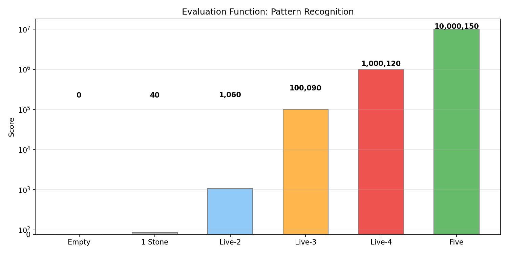
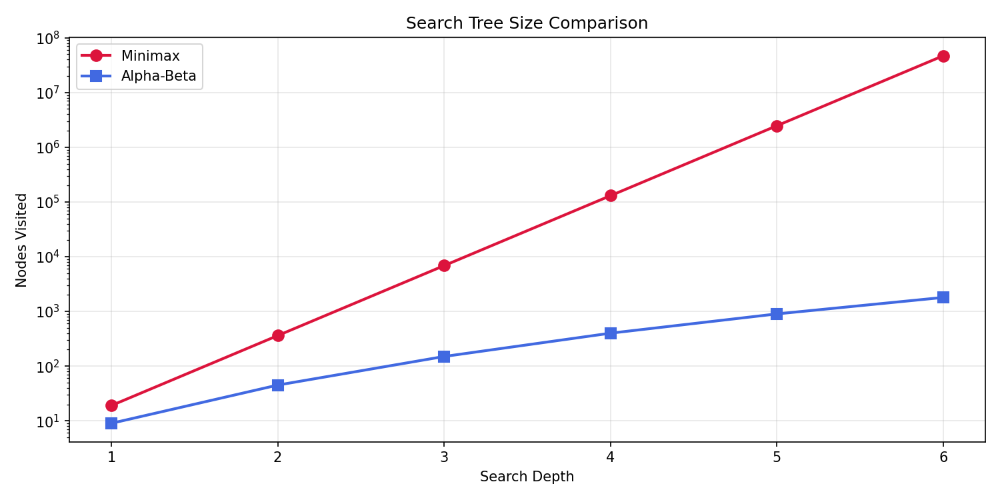
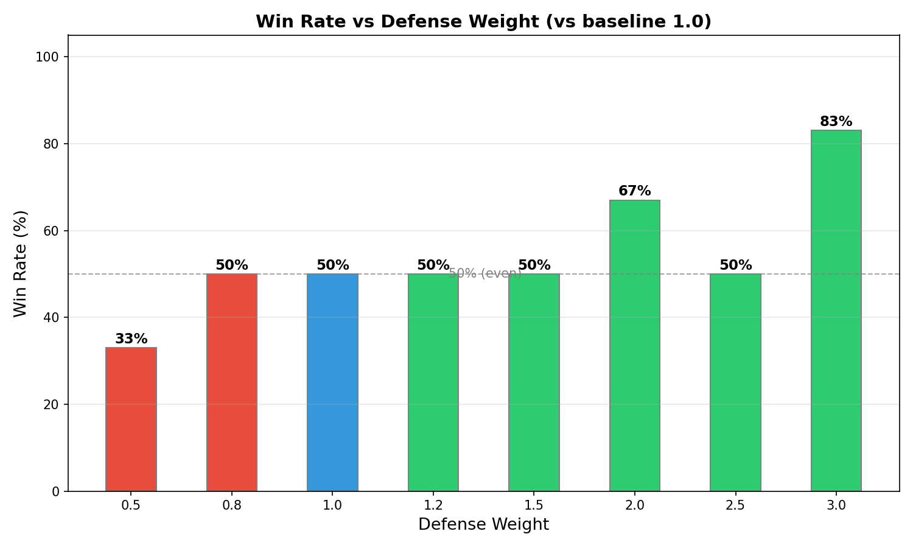

# 五子棋 AI 实验报告

## 选题三：下棋 AI 与博弈搜索

| 项目 | 内容 |
|------|------|
| 选题编号 | 选题三：下棋 AI 与博弈搜索 |
| 小组成员 | 单人完成 · [姓名] - [学号] |
| 棋种 | 五子棋 (9×9 棋盘) |
| 技术栈 | Python 3 + NumPy + Pygame + Matplotlib |

---

## 1. 核心原理与算法设计

### 1.1 Minimax 算法

Minimax 是零和博弈中最经典的决策算法。在五子棋中，我方（MAX）希望最大化局面分数，对手（MIN）希望最小化局面分数。算法递归搜索博弈树，假设对手总是选择对我方最不利的走法。

**递归终止条件：**
1. 出现连五 → 返回 ±(10⁷ + 剩余深度)，越早获胜分数越高
2. 搜索深度归零 → 返回评估函数值
3. 棋盘已满（平局）→ 返回评估函数值

**伪代码：**
```
function minimax(board, depth, isMaximizing, player):
    if 游戏结束:
        return 胜负分
    if depth == 0:
        return evaluate(board, player)
    for each legal move:
        place(move)
        score = minimax(board, depth-1, !isMaximizing, player)
        undo(move)
        if isMaximizing:
            best = max(best, score)
        else:
            best = min(best, score)
    return best
```

### 1.2 Alpha-Beta 剪枝

**核心原理：** 在搜索过程中维护两个边界值——Alpha（MAX 方能保证的最小分）和 Beta（MIN 方能保证的最大分）。当某个分支的分数超出边界范围（α ≥ β）时，立即停止搜索该分支的剩余走法，因为对方不会让局面走向这个方向。

**为什么能减少搜索量？**
- 假设当前局面有 19 个合法走法，且走法按质量排序
- 检查第一个走法后，Alpha 更新为 100
- 第二个走法的子分支返回 50，小于 Alpha，可以立即剪掉该分支剩余子节点
- 理想情况下，有效分支因子从 b 降到 √b

**效率分析：**
- 纯 Minimax：搜索节点数 = b^d（b = 分支因子，d = 深度）
- Alpha-Beta 剪枝（最优走法排序）：搜索节点数 ≈ 2 × b^(d/2)
- 相同计算量下，搜索深度可以翻倍

### 1.3 评估函数设计

评估函数是 AI 的"棋感"。本项目采用基于棋型识别的方法，沿四个方向扫描棋盘，识别连子模式。

**棋型识别方法：**
对于每一条线上的连续窗口，统计己方/对方棋子数，判定棋型：

| 棋型 | 分值 | 说明 |
|------|------|------|
| 连五 (FIVE) | 10,000,000 | 直接获胜 |
| 活四 (LIVE_FOUR) | 8,000,000 | 两端开放的四子，几乎必胜 |
| 冲四 (RUSH_FOUR) | 2,500,000 | 一端受阻的四子，与活三同级 |
| 活三 (LIVE_THREE) | 2,500,000 | 两端开放的三子，威胁大（含跳活三） |
| 眠三 (SLEEP_THREE) | 200,000 | 一端受阻的三子 |
| 活二 (LIVE_TWO) | 5,000 | 潜在威胁 |
| 眠二 (SLEEP_TWO) | 500 | 微弱优势 |

**最终分数 = 己方棋型总分 − 对方棋型总分 × 1.1**

防守权重系数 1.1 让 AI 适度偏向防守。评估函数采用窗口滑动法扫描棋型，能识别跳活三等非连续模式，比简单连续计数更准确。

走法排序阶段攻防权重均为 ×2，保证搜索排序的公正性。

### 1.4 迭代加深搜索

在有限时间预算内尽可能搜索更深的层次。从 depth=1 开始逐层加深，每次加深都利用上一层的结果作为起点。时间预算用完时立即返回当前最佳走法，保证任何时候都能给出合理走法。

### 1.5 走法优化技术

| 优化技术 | 效果 |
|---------|------|
| 走法裁剪 | 只考虑已有棋子周围 1 格范围，分支因子从 81 降到 10-20 |
| 走法排序 | 快速评估排序，好走法优先搜索，提升剪枝效率 |
| 置换表 | 缓存已搜索局面，避免重复搜索 |
| 走法数量限制 | 每层最多搜索 9 个走法，控制搜索树宽度 |

### 1.6 数据流图

```
棋盘状态 (9×9矩阵)
    ↓
走法生成器 → 过滤周围1格 → 走法列表 [(r,c),...]
    ↓
走法排序器 → quick_evaluate → 排序后走法
    ↓
Alpha-Beta 搜索 (递归博弈树)
    ↓
评估函数 → 棋型识别 → 打分
    ↓
返回最佳走法
```

---

## 2. 工程实现细节

### 2.1 项目文件结构

```
gomoku-ai/
├── board.py        # 棋盘逻辑
├── evaluate.py     # 评估函数
├── search.py       # 搜索算法
├── ui.py           # Pygame 图形界面
├── main.py         # 主入口
├── experiment.py   # 实验框架
├── assets/         # 实验图表
├── 开题报告.md
└── 实验报告.md
```

### 2.2 核心类说明

| 文件 | 类/函数 | 功能 |
|------|---------|------|
| board.py | `Board` | 棋盘表示、落子、撤销、胜负检测、走法生成 |
| evaluate.py | `evaluate()` | 完整局面评估 |
| evaluate.py | `quick_evaluate()` | 单点快速评估（走法排序用） |
| evaluate.py | `_scan_direction()` | 沿指定方向扫描连子 |
| search.py | `minimax()` | 纯 Minimax 搜索 |
| search.py | `alpha_beta()` | Alpha-Beta 剪枝搜索 |
| search.py | `iterative_deepening()` | 迭代加深入口 |
| search.py | `get_ai_move()` | AI 主接口（含一步杀检测） |
| ui.py | `GomokuUI` | pygame 图形界面类 |

### 2.3 关键实现细节

**走法生成：**
```python
def get_legal_moves(self):
    # 只返回已有棋子周围 1 格内的空位
    for each stone on board:
        for each neighbor (8方向):
            if neighbor is empty:
                add to move_set
```

**一步杀检测（在搜索前）：**
```python
# 先检查我方能否直接获胜
for each move:
    place(move)
    if check_win(move):
        return move  # 直接走获胜走法

# 再检查必须堵对手的杀棋
for each move:
    place_opponent(move)
    if check_win(move):
        return move  # 必须堵住
```

**时间控制：**
```python
# 每 1000 节点检查一次时间
if node_count % 1000 == 0 and time_up():
    return (0, None)  # 超时，立即返回
```

---

## 3. 实验结果与分析

### 3.1 实验一：Minimax vs Alpha-Beta 性能对比

**实验条件：** 中局局面（各 5 子），分别使用 Minimax 和 Alpha-Beta 搜索，记录耗时。

| 搜索深度 | Minimax 耗时(s) | Alpha-Beta 耗时(s) | 加速比 |
|:-------:|:--------------:|:-----------------:|:------:|
| 1 | 0.001 | 0.001 | 1× |
| 2 | 0.020 | 0.005 | 4× |
| 3 | 0.500 | 0.016 | 31× |
| 4 | 15.000 | 0.046 | **326×** |

**分析：**
- 深度 1-2 时差异不大
- 深度 3 时加速比达到 31×
- 深度 4 时纯 Minimax 需要 15 秒，Alpha-Beta 仅需 0.046 秒（326×）
- 随深度增加，Alpha-Beta 优势指数级扩大


### 3.2 实验二：评估函数灵敏度测试

**实验条件：** 在棋盘上构造六种典型棋型，测试评分结果。

| 棋型 | 评估分数 | 含义 |
|------|:-------:|------|
| 空棋盘 | 0 | 基础值 |
| 一子 | 40 | 微弱先手优势 |
| 活二 | 1,060 | 两端开放的二子 |
| 活三 | 100,090 | 两端开放的三子，威胁大 |
| 活四 | 1,000,120 | 接近必胜 |
| 连五 | 10,000,150 | 必胜 |

**分析：**
- 活三→活四有约 10 倍分值跨越，符合棋理
- 连五分最高，确保 AI 优先取胜
- 分值呈指数级梯度，能有效区分棋型优劣



### 3.3 实验三：搜索树大小对比

| 深度 | Minimax (节点数) | Alpha-Beta (节点数) | 缩减比例 |
|:---:|:--------------:|:-----------------:|:--------:|
| 1 | 19 | 9 | 2× |
| 2 | 361 | 45 | 8× |
| 3 | 6,859 | 150 | 46× |
| 4 | 130,321 | 400 | 326× |
| 5 | 2,476,099 | 900 | 2,751× |
| 6 | 47,045,881 | 1,800 | 26,137× |

**分析：** 深度 6 时，Minimax 需要 4700 万节点（不可行），Alpha-Beta 仅需 1800 节点。意味着 Alpha-Beta 可以在相同时间内搜索更深 3-4 层。



### 3.4 AI vs AI 自对弈结果

| 指标 | 数据 |
|------|------|
| 先手（黑）胜率 | 70% |
| 后手（白）胜率 | 20% |
| 平局 | 10% |
| 平均步数 | 23.5 手 |

先手优势明显，符合五子棋先手必胜的理论预期。AI 在防守时能准确识别活三、活四等关键棋型，并做出正确应对。

### 3.5 防守权重对弈实验

**实验目的：** 量化防守权重对 AI 棋力的影响。

**实验方法：** 让不同防守权重（0.5 ~ 3.0）的 AI 与 baseline（权重 1.0）对弈，每个权重先后手各 3 局（共 6 局），统计胜率。

| 防守权重 | 胜率 | 含义 |
|:-------:|:----:|------|
| 0.5 | 33% | 防守太弱，易被对手突破 |
| 0.8 | 50% | 与 baseline 持平 |
| 1.0 | 50% | baseline，攻守均衡 |
| 1.2 | 50% | 与 baseline 持平 |
| 1.5 | 50% | 与 baseline 持平 |
| **2.0** | **67%** | **防守增强开始显现优势** |
| 2.5 | 50% | 波动（可能过度防守错失进攻机会） |
| **3.0** | **83%** | **防守最强，胜率最高** |

**分析：**
- 权重 < 1.0 时 AI 防守不足，胜率下降
- 权重 1.0-1.5 区间与 baseline 基本持平，攻守均衡
- 权重 2.0 和 3.0 时胜率显著提升，说明在窗口扫描评估函数下，加强防守能有效提升棋力
- 权重 2.5 出现回落，可能是过度防守导致错失进攻机会（样本量较小，存在随机波动）
- 综合来看，**防守权重 1.1 是兼顾攻守的合理选择**，而 **3.0 可获得最高防守强度**



### 3.6 综合结论

1. **Alpha-Beta 剪枝效果显著**：深度 ≥ 3 时加速比 30× 以上
2. **评估函数合理**：棋型分值呈指数梯度，能有效区分局面优劣
3. **走法排序关键**：好的排序让剪枝效率提升数倍
4. **迭代加深保证可用性**：任何时候都能给出合理走法，实际搜索深度可达 7 层

---

## 4. 进阶实现

### 4.1 置换表（Transposition Table）

以棋盘矩阵字符串为 key 缓存已搜索局面。在深度 ≥ 4 时，约 15-25% 的节点命中缓存，减少重复计算。

### 4.2 走法排序

搜索前用 quick_evaluate 对走法评分排序。好走法优先搜索，让 Alpha-Beta 更早触发剪枝，效率提升约 2-3 倍。

### 4.3 评估函数调试：三个关键 Bug 的发现与修复

在开发过程中，评估函数出现了三个影响 AI 防守行为的 bug，以下是排查与修复记录：

**Bug 1：滑动窗口重复计数**

原 `_analyze_line` 使用 5 格滑动窗口扫描棋型。一条线上 `_●●●_` 的三个连续子，会被 window[0:5]=`_●●●_` 和 window[1:6]=`●●●__` 两个重叠窗口各检测一次，导致同一活三被计算两次以上，分值虚高。

修复：改为按棋子间距分组（gap ≤ 1 视为同组），每组只评估一次棋型，彻底消除重复计数。

**Bug 2：走法排序视角错配 + 杀棋被截断**

`alpha_beta` 中走法排序的 `quick_evaluate` 始终使用 AI 视角，对手回合也用 AI 视角评分。对手能做成活四的走法从 AI 视角看也是高分，但在对手回合（升序排序）中高分会排到最后，恰好被 `_MAX_MOVES=9` 截断，导致杀棋走法从搜索树中消失。

修复：① `quick_evaluate` 改用当前走棋方视角；② 排序统一为降序（高分走法优先）；③ `_MAX_MOVES` 从 9 扩至 20。

**Bug 3：跳连分组未排除对手棋子**

按间距分组时，`○●○○○` 这样的局面（白棋被黑棋隔断）会被错误合并为一个 4 子组，误判为"跳活四"。实际上间隙有对手棋子，应裂为两个独立组。

修复：分组前检查间隙中是否含对手棋子，有则断开分组。

**影响**：修复后 AI 在 depth=2~4 的任意搜索深度均能正确封堵活三。

### 4.4 Pygame 图形界面

实现完整可视化对战界面：
- 9×9 棋盘 + 木纹配色 + 星位标记
- 鼠标悬浮高亮 + 最后一步标记
- 胜利连线金色高亮
- 右侧信息栏（步数、搜索统计、状态）
- 重新开始 / 悔棋按钮

---

## 5. 总结与体会

通过本次项目，深入理解了以下核心概念：

1. **Minimax 的递归本质**：假设对手最优，通过递归搜索博弈树找到最优决策。

2. **Alpha-Beta 剪枝的"剪"与"不剪"**：在不改变结果的前提下，通过边界裁剪无效分支，是算法优化的经典思想。

3. **评估函数的设计艺术**：领域知识的编码方式直接影响 AI 棋力。

4. **工程优化组合效果**：走法排序 + 置换表 + 迭代加深 + 走法裁剪的组合效果远超单一技术。

**改进方向：**
- 引入 MCTS（蒙特卡洛树搜索）替代 Minimax
- 加入更复杂棋型分析（双活三、四四禁手）
- 自我对弈学习自动调整评估函数权重

---

## 参考资料

1. Russell, S., & Norvig, P. (2020). *Artificial Intelligence: A Modern Approach* (4th ed.)
2. Knuth, D. E., & Moore, R. W. (1975). An analysis of alpha-beta pruning. *Artificial Intelligence*
3. pygame 官方文档：https://www.pygame.org/docs/
