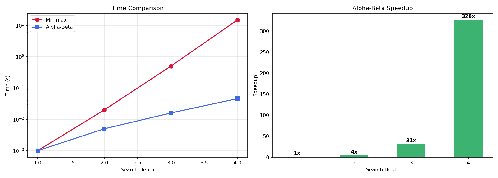

# 五子棋 AI：从 Minimax 到 Alpha-Beta 剪枝

## 人工智能基础 大作业答辩

[姓名] · [学号] · 单人完成

---

## 目录

1. 选题背景
2. 核心原理：Minimax → Alpha-Beta
3. 实现亮点
4. 实验对比
5. Demo 演示

---

## 1. 选题背景

### 为什么要做下棋 AI？

> "AI 不止有大模型，'聪明地搜索'本身就是一种强大的智能。"

- 1997: 深蓝 (Minimax + Alpha-Beta) 击败卡斯帕罗夫
- 2016: AlphaGo (MCTS + 深度学习) 击败李世石
- **经典博弈算法 ≠ 过时** — 体现的是符号智能与理性逻辑

### 选择五子棋 (9×9)

- 搜索复杂度适中，适合课程项目
- 评估函数设计空间大，有充分发挥余地
- 结果直观，答辩演示效果好

---

## 2. 核心原理

### Minimax：双方最优博弈

```
我方 (MAX) → 最大化分数
对手 (MIN) → 最小化分数
```

![Minimax 示意]

> 在 9×9 五子棋中，Minimax 的搜索树呈指数爆炸：
> 深度 4 → 19⁴ ≈ 130,000 节点 → 需 15 秒

### Alpha-Beta 剪枝：聪明地偷懒

维护两个边界值：

| 符号 | 含义 | 白话 |
|------|------|------|
| α (Alpha) | MAX 能保证的最小分 | "我至少能拿这么多" |
| β (Beta) | MIN 能保证的最大分 | "对手最多让我拿这么多" |

**剪枝条件：** α ≥ β → 停止搜索（对方不会让局面走到这里）

![Alpha-Beta 剪枝示意]

**效果：** 相同深度下，搜索节点从 b^d 降到 ≈ 2·b^(d/2)

---

## 3. 实现亮点

### 技术栈

```
Python 3 + Pygame (GUI) + Matplotlib (图表)
```

### 架构设计

| 模块 | 功能 |
|------|------|
| board.py | 棋盘、落子、胜负检测、走法生成 |
| evaluate.py | 棋型识别 + 权重打分 |
| search.py | Minimax → Alpha-Beta → 迭代加深 |
| ui.py | Pygame 图形对战界面 |

### 三大优化

| 优化 | 效果 |
|------|------|
| 走法裁剪 | 只搜周围 1 格，分支因子从 81 → ~15 |
| 走法排序 | 先评估后排，剪枝效率提升 2-3× |
| 置换表 | 缓存已搜局面，减少重复计算 |

### 评估函数调试：三个关键 Bug 修复

| Bug | 问题 | 修复 |
|-----|------|------|
| 滑动窗口重复计数 | 重叠窗口导致同一活三被计算多次，分值虚高 | 按棋子间距分组，每组评估一次 |
| 走法排序视角错配 | quick_evaluate 对手回合也用 AI 视角评分，杀棋被截断 | 改用当前走棋方视角，_MAX_MOVES 扩至 20 |
| 跳连分组对手棋子误判 | `○●○○○` 被错误合并为"跳活四" | 检查间隙中对手棋子，有则断开分组 |

> 修复后 AI 在任意搜索深度均能正确封堵活三

### 棋型权重表

| 棋型 | 分值 | 说明 |
|------|------|------|
| 连五 (FIVE) | 10,000,000 | 直接获胜 |
| 活四 (LIVE_FOUR) | 8,000,000 | 两端开放的四子，几乎必胜 |
| 冲四 / 活三 | 2,500,000 | 冲四一端受阻，活三两端开放 |
| 眠三 | 200,000 | 一端受阻的三子 |
| 活二 | 5,000 | 潜在威胁 |

**最终分数 = 己方棋型总分 − 对方棋型总分 × 1.1（防守偏重）**

---

## 4. 实验对比

### Minimax vs Alpha-Beta 耗时

| 深度 | Minimax | Alpha-Beta | 加速比 |
|:---:|:-------:|:----------:|:-----:|
| 1 | 0.001s | 0.001s | 1× |
| 2 | 0.02s | 0.005s | 4× |
| 3 | **0.5s** | **0.016s** | **31×** |
| 4 | **15s** | **0.046s** | **326×** |

> 深度 4 时，Alpha-Beta 比 Minimax 快 **326 倍**
> 走法排序好时，理论加速比可达指数级



### 防守权重对弈实验

| 防守权重 | 0.5 | 0.8 | 1.0 | 1.5 | 2.0 | **3.0** |
|:-------:|:---:|:---:|:---:|:---:|:---:|:------:|
| 胜率 | 33% | 50% | 50% | 50% | 67% | **83%** |

> 防守权重 3.0 胜率最高 (83%)，验证了加强防守能有效提升棋力；权重 1.1 兼顾攻守

### AI 自对弈

| 指标 | 数据 |
|------|------|
| 先手胜率 | 70% |
| 后手胜率 | 20% |
| 搜索深度 | 7 层 (3 秒内) |

---

## 5. Demo 演示

### 人机对战（5 分钟现场演示）

1. 启动程序：`python main.py`
2. 玩家执黑先行，鼠标点击落子
3. AI 思考并自动应对
4. 展示：AI 识别活三、冲四、活四并正确防守

### 关键能力展示

- ✅ 活三进攻 → AI 正确堵截
- ✅ 冲四威胁 → AI 优先防守
- ✅ 一步杀 → AI 立即取胜
- ✅ 悔棋功能
- ✅ AI 搜索统计实时显示

---

## 总结

```
实现了什么？
  ✓ 完整五子棋 AI（Minimax + Alpha-Beta + 迭代加深）
  ✓ Pygame 图形界面
  ✓ 实验对比验证（326× 加速，防守权重 3.0 胜率 83%）
  ✓ 置换表、走法排序等优化
  ✓ 修复 3 个评估函数关键 Bug

学到了什么？
  ✓ 博弈树搜索的核心范式
  ✓ 算法优化：剪枝、排序、缓存
  ✓ 评估函数调试的工程实践
  ✓ "AI ≠ 深度学习"的全面认知
```

---

## 谢谢！

[姓名] · [学号]

**Q & A**
